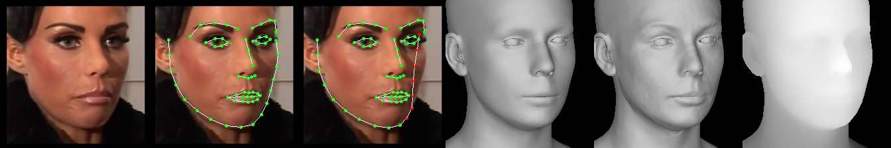
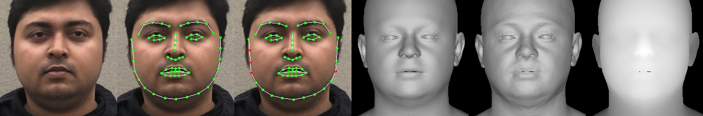
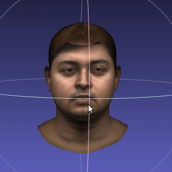

# cs_project
# Make your own emoji

This is project archive of Lecture 'Creative and Self-motivating Project'

preperation 
## Getting Started
Clone the repo:
  ```bash
  git clone https://github.com/caisarl76/cs_project.git
  cd cs_project
  ```  
### Requirements
* Python 3.7 (numpy, skimage, scipy, opencv)  
* PyTorch >= 1.6 (pytorch3d)  
* face-alignment (Optional for detecting face)  
  You can run 
  ```bash
  pip install -r requirements.txt
  ```
  Or use virtual environment by runing 
  ```bash
  bash install_conda.sh
  ```
 ### Usage
1. Prepare data   
    a. download [FLAME model](https://flame.is.tue.mpg.de/download.php), choose **FLAME 2020** and unzip it, copy 'generic_model.pkl' into ./data  
    b. download [DECA trained model](https://drive.google.com/file/d/1rp8kdyLPvErw2dTmqtjISRVvQLj6Yzje/view?usp=sharing), and put it in ./data (**no unzip required**)  
    c. (Optional) follow the instructions for the [Albedo model](https://github.com/TimoBolkart/BFM_to_FLAME) to get 'FLAME_albedo_from_BFM.npz', put it into ./data


2. Make face model
    a. **reconstruction**  
    ```bash
    python demos/demo_reconstruct.py -i images/vgg_face2_samples/ -s images/results/
    ```   
    to visualize the predicted 2D landmanks, 3D landmarks (red means non-visible points), coarse geometry, detailed geometry, and depth.   
    <p align="center">   
    
    </p>  
    <p align="center">   
    
    </p>  
    You can also generate an obj file (which can be opened with Meshlab) that includes extracted texture from the input image.  

    Please run `python demos/demo_reconstruct.py --help` for more details. 

    b. **expression transfer**   
    ```bash
    python demos/demo_transfer.py
    ```   
    Given an image, you can reconstruct its 3D face, then animate it by tranfering expressions from other images. 
    Using Meshlab to open the detailed mesh obj file, you can see something like that:
    <p align="center"> 
    
    </p>  
   
    
    Note that, you need to set '--useTex True' to get full texture.   

    c. for the teaser gif
    ```bash
    python demos/demo_teaser.py 
    ``` 
    
    More demos and training code coming soon.
